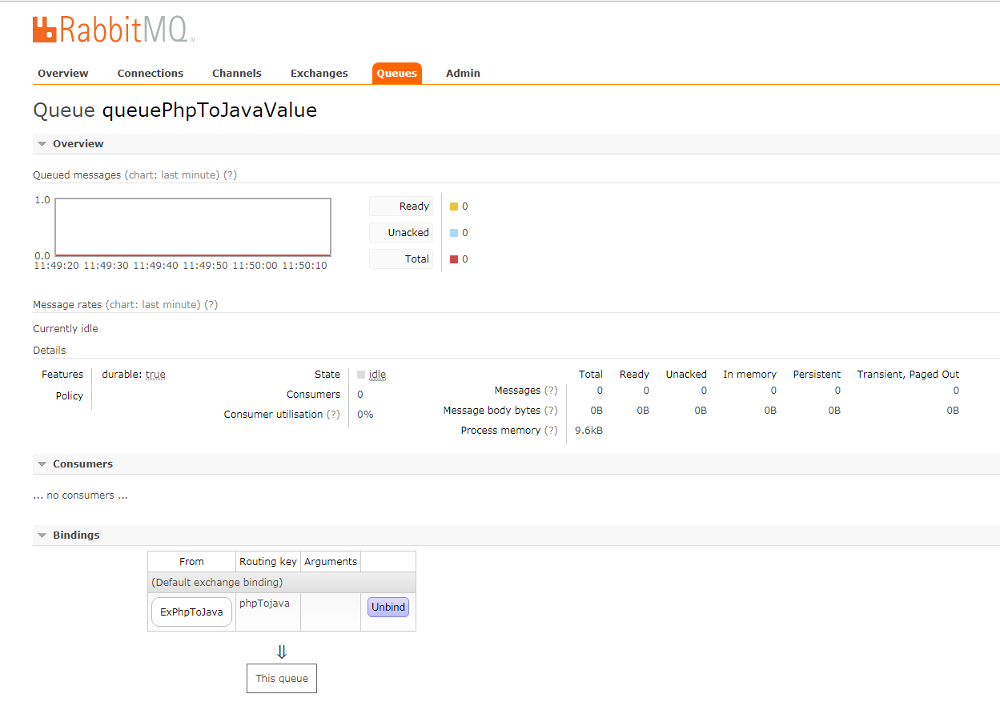

php连接rabbitmq中间件需要先new出一个amqp模块内置的方法出来, 完成之后在将数据进行处理或者发送, php向rabbitmq发送消息的速度非常快.

```php
$conn = new AMQPConnection(array(
    'host' => "192.168.1.1",
    'port' => "5672",
    'login' => "seliencepuppet",
    'password' => "seliencepuppet123",
    'vhost' => '/'
));
```

创建好连接之后还需要创建一个通道, 这个通道的建立, 将决定php与rabbitmq之间建立一条直通的通道
```php
// 创建连接和channel
if (!$conn->connect()) {
    die("Cannot connect to the broker");
}
```

如果连接成功就代表已经和rabbitmq连接好了, 如果没有连接上, 就会抛出以下错误 'Cannot connect to thr broker'.

连接好了之后需要设置对应的交换机名称, 队列绑定名字, 路由键值

```php
$e_name = 'ExPhpToJava';
$q_name = 'queuePhpToJavaValue';
$k_route = 'phpTojava';
```

创建rabbitmq数据通信通道
```php
$channel = new AMQPChannel($conn);
```

绑定一个exchange作为发送数据或接收数据的声明
```php
$ex = new AMQPExchange($channel);
```

设置交换机的名称
```php
$ex->setName($e_name);
```

设置交换机的类型用于决定该数据是直连还是广播或者是其它方式进行传递
```php
$ex->setType(AMQP_EX_TYPE_DIRECT);
```

以下是rabbitmq中间件的配置信息



声明获取消息的queue名称
```php
$queue = new AMQPQueue($channel);
$queue->setName($q_name);
$queue->setFlags(AMQP_DURABLE);
$queue->declareQueue();
```


将交换机与队列进行绑定并指定路由键值来获取消息和发送消息
```php
$queue->bind($e_name, $k_route);
```

设置代码去接收该队列(queue)当中的消息, 取出完成之后将其处理掉
```php
$messages = $queue->get(AMQP_AUTOACK);
if ($messages !== false) {
    $receive = chop($messages->getBody());
    $message = json_decode($receive, true);
    echo json_encode($message) . "\n";
}
```
