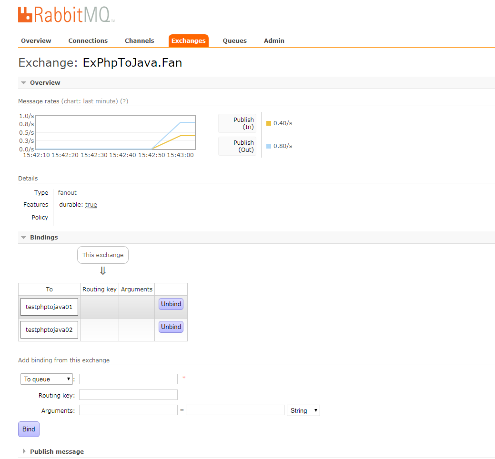
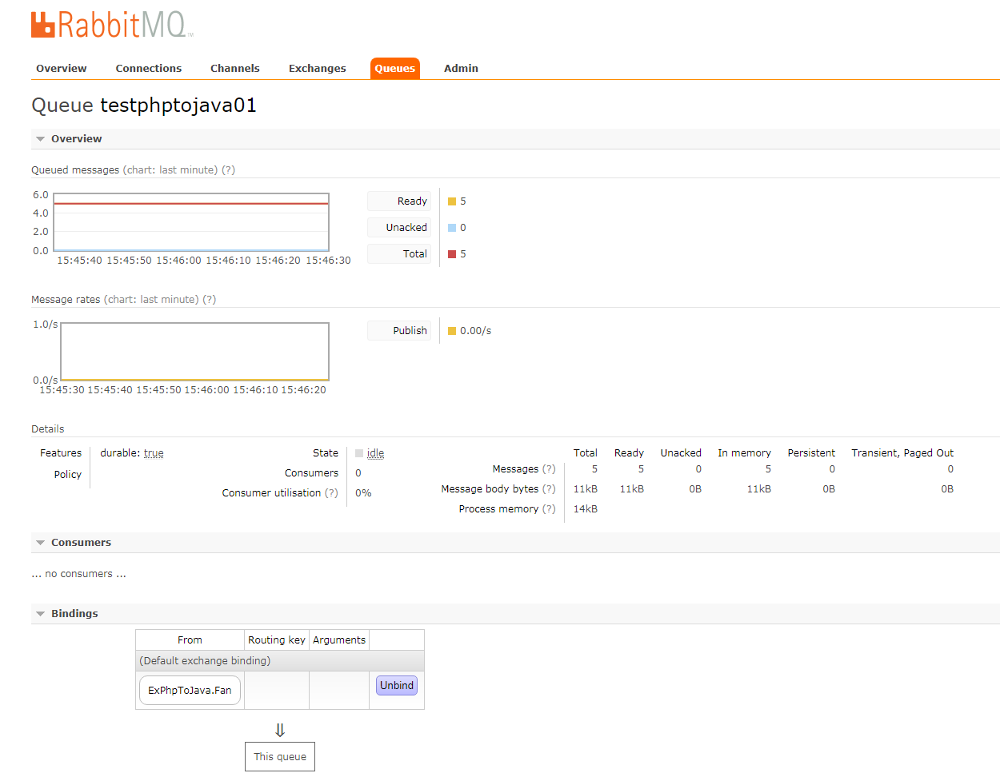
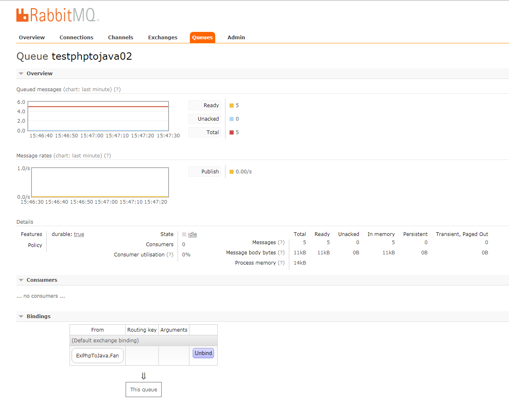

php连接rabbitmq发送消息使用广播模式







## 以下是广播模式发送的样例代码

```SendMessagePhpToJavaFanout.php
<?php

include 'db.php';

error_reporting(E_ALL);
ini_set('display_errors', '1');
ini_set('date.timezone','Asia/Shanghai'); 
set_time_limit(0);
$conn = new AMQPConnection(array(
	'host' => "10.203.206.234",
	'port' => "5672",
	'login' => "hitrader",
	'password' => "hitrader123",
	'vhost' => '/'
));

if (!$conn->connect()) {
	die("Cannot connect to the broker");
}

$e_name = 'ExPhpToJava.Fan';
$k_route = '';

$channel = new AMQPChannel($conn);
$ex = new AMQPExchange($channel);
$ex->setName($e_name);
$ex->setType(AMQP_EX_TYPE_FANOUT);

$mes = commodity_data();

echo json_encode($mes) . "\n";

$send_res = $ex->publish(json_encode($mes), $k_route);

?>
```
