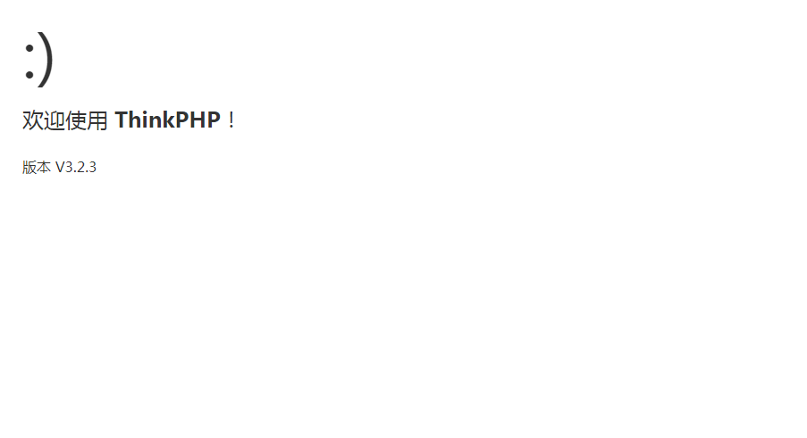

将ThinkPHP文件拷贝到/web/ceshi目录下然后编辑index.php文件

```shell
[root@zhangyz ceshi]# vim index.php
```

```php
<?php

// 检测PHP环境
if(version_compare(PHP_VERSION,'5.3.0','<'))  die('require PHP > 5.3.0 !');

// 开启调试模式 建议开发阶段开启 部署阶段注释或者设为false
define('APP_DEBUG',True);

// 定义应用目录
define('APP_PATH','./Application/');

// 引入ThinkPHP入口文件
require './ThinkPHP/ThinkPHP.php';

// 亲^_^ 后面不需要任何代码了 就是如此简单
?>

```

编辑完成之后需要打开浏览器去进行访问 http://192.168.1.1:86/index.php



在当前目录下执行查看命令可以看到该框架自动帮忙生成了一个叫Application的文件夹
```shell
[root@zhangyz ceshi]# ls
Application  index.php  ThinkPHP
```

ThinkPHP不但会自动生成一个Application的目录还会在Application/Home/Controller下生成一个IndexControoler.class.php的文件, 这个文件就是访问该项目的入口控制器文件.

```php
<?php
namespace Home\Controller;
use Think\Controller;
class IndexController extends Controller {

    public function index(){
        $this->show('<style type="text/css">*{ padding: 0; margin: 0; } div{ padding: 4px 48px;} body{ background: #fff; font-family: "微软雅黑"; color: #333;font-size:24px} h1{ font-size: 100px; font-weight: normal; margin-bottom: 12px; } p{ line-height: 1.8em; font-size: 36px } a,a:hover{color:blue;}</style><div style="padding: 24px 48px;"> <h1>:)</h1><p>欢迎使用 <b>ThinkPHP</b>！</p><br/>版本 V{$Think.version}</div><script type="text/javascript" src="http://ad.topthink.com/Public/static/client.js"></script><thinkad id="ad_55e75dfae343f5a1"></thinkad><script type="text/javascript" src="http://tajs.qq.com/stats?sId=9347272" charset="UTF-8"></script>','utf-8');
    }

}
```
